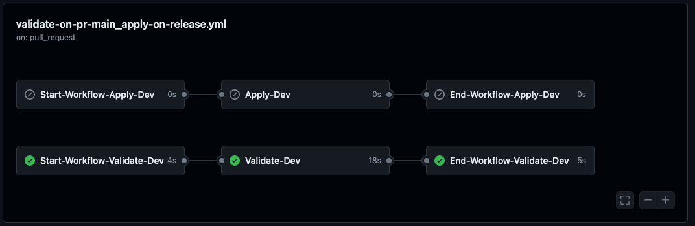
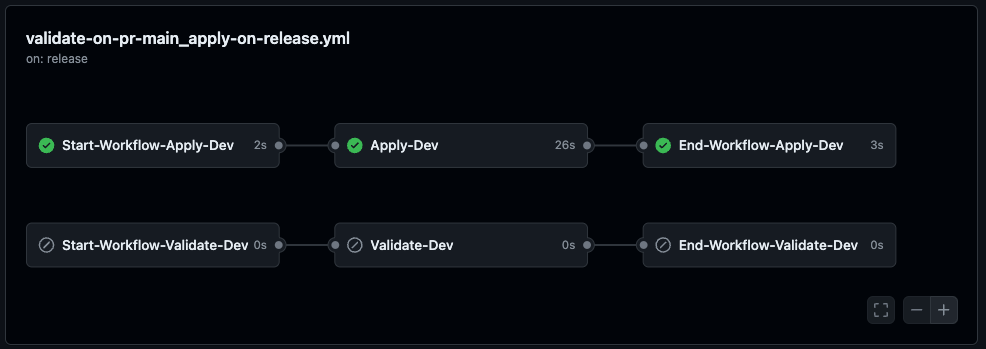
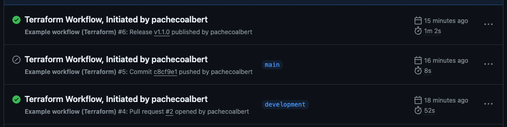

# Example Workflows

| Workflow        | Trigger       | Description   |
| --------------- | ------------- | -------------- |
| validate-on-pr-main_apply-on-release.yml  [Instructions](#validate-on-pr-main_apply-on-release)   | PR to main , Published Release to main | This workflow triggers on PR to main and runs a Terraform plan.  After PR merged to main, Terraform apply is triggered on published release to main. |

# validate-on-pr-main_apply-on-release
Overview of the validate-on-pr-main_apply-on-release workflow.

## Build Instructions
This infrastructure is built via Terraform IaC.  To build or update the infrastructure, follow the below steps.

1. __Validate Terraform (plan):__ Commit to 'development' branch and generate PR to main this will issue terraform plan.  



2. __Deploy to OCI (Apply):__ Publish a new tagged release to main branch.  This will trigger a terraform apply to the specific environment.




## View of complete workflow from  
Here is a view of a complete set of workflows (plan/apply) to deploy or update an OCI stack.


## Deploy this workflow
To deploy this workflow, simply copy it to the `workflows` directory.
This can be done by navigating to the example_workflow. See example
``` 
cd ./.github/workflows/sample_workflows
cp ./validate-on-pr-main_apply-on-release.yml ../
```

