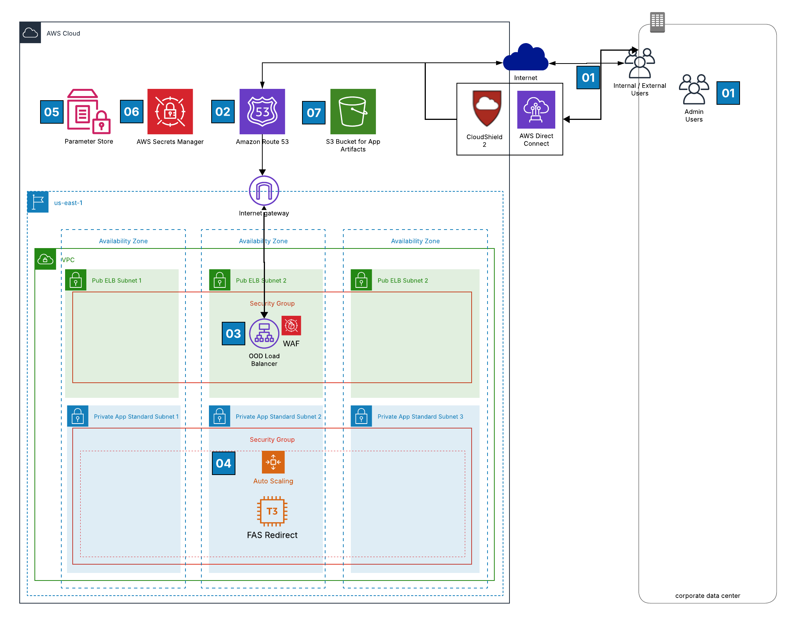
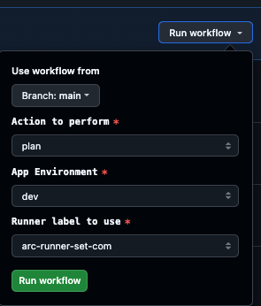
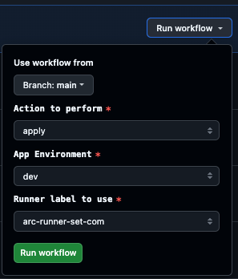
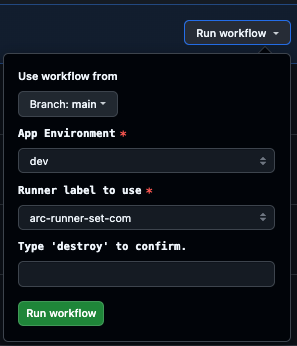
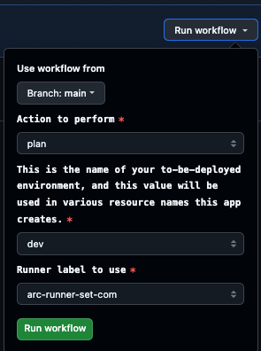
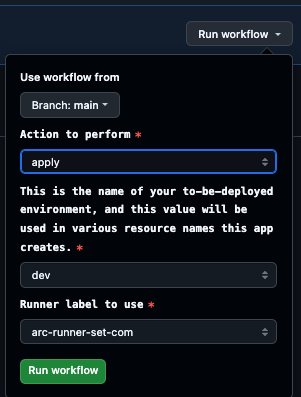
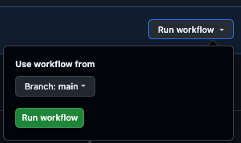

# **[REPLACE WITH PRODUCT]** Application

## About
The repository is used to provision the **[REPLACE WITH PRODUCT]** stack in AWS.  To deploy this infrastructure follow the [Deployment Instructions](#deployment-instructions).

1. [Arch Diagram Narrative](#architecture-diagram)
2. [Deployment Instructions](#deployment-instructions)
3. [Terraform Documentation](#terraform-documentation)

## Architecture Diagram
**SAMPLE - REPLACE**



### Narrative
**SAMPLE - REPLACE**
1. Internal and External Users can connect to the application and AWS resources via the public internet or internally via CloudShield 2 Direct Connect.  
2. External/Internal DNS view from Efficient IP resolves to Route 53 CNAME and is directed to "internet-facing" Application Load Balancers'.
3. The Application Load Balancer will have a WAF ACL attached to it and Shield Advanced. It will use the "Fortinet Managed Rule Groups" "OWASP Top 10. A Security Group will be attached to the ALB that will allow HTTP/HTTPS from the public internet with restrictions.  HTTP traffic will be redirected to HTTPS at the ALB via ALB rule. Load Balancer logs will be directed to an S3 Bucket
4. The application has been deployed to an Autoscaling Group to facilitate resource bursting and auto recovery of instance failures.  Security Group has been applied to the application instances allowing HTTP/S traffic from the Application Load Balancer as well as direct administrative access over SSH.  Authentication is managed by HarvardKey (Okta) and Grouper.
5. Parameter Store is used to pull the latest HUIT image for the application servers.
6. AWS Secrets Manager is used to store secrets that are used by the application. 
7. An AWS S3 bucket has been deployed and is use to store application artifacts and/or Load Balancer logs. 

# Deployment Instructions
The application infrastructure is managed via GitHub Actions.  This repository contains three GitHub Action Workflows.  The infrastructure is built via Terraform and deployed with the below ***Build App*** GitHub Action Workflow.

## Build App
This workflow will validate and build/deploy an AWS application defined in the Terraform configuration in this repo. It is triggered manually by the user and will prompt for the Terraform 'Action', app environment name, and the runner. 
- View GitHub Action Workflow Source for [Build App](.github/workflows/build_app.yaml)
- Execute the [Build App GitHub Action](https://github.com/harvard-huit/[REPLACE_WITH_REPO]/actions/workflows/build_app.yaml)

When executing the workflow, you need to specify:
-  Repo branch: development or main (others options can be available)
-  Action to perform: Plan or Apply 
-  App Environment: dev, test, prod (others options can be available)
-  Runner label to use: huit or arc-runner-set-com (default)
  
Here is an example of a workflow run of a **terraform plan** against the development branch and dev environment



Here is an example of a workflow run of a **terraform apply** against the development branch and dev environment




## Destroy App
This workflow will destroy the application infrastructure using Terraform. It is triggered manually by the engineer and will prompt for the application environment name, and the runner. 
- View GitHub Action Workflow Source for [Destroy App](.github/workflows/destroy_app.yaml)
- Execute the [Destroy App GitHub Action](https://github.com/harvard-huit/[REPLACE_WITH_REPO]/actions/workflows/destroy_app.yaml)

When executing the workflow, you need to specify:
-  Repo branch: development or main (others options can be available)
-  App Environment: dev, test, prod (others options can be available)
-  Runner label to use: huit or arc-runner-set-com (default)
-  Type 'destroy' to confirm:  enter 'destroy' to prevent accidental run

Here is an example of a workflow run of a **terraform destroy** against the main branch and dev environment



## Terraform Verify
This workflow is intended to be used to view & resolve state file drift.  It will refresh the state of the app infrastructure via `terraform plan/apply -refresh-only`. It is triggered manually like the previous workflows.
- View GitHub Action Workflow Source for [Terraform Verify](.github/workflows/terraform_state_verify.yaml)
- Execute the [Terraform Verify GitHub Action](https://github.com/harvard-huit/[REPLACE_WITH_REPO]/actions/workflows/terraform_state_verify.yaml)

When executing the workflow, you need to specify:
-  Repo branch: development or main (others options can be available)
-  Action to perform: Plan or Apply 
-  App Environment: dev, test, prod (others options can be available)
-  Runner label to use: huit or arc-runner-set-com (default)
  
Here is an example of a workflow run of a **terraform plan -refresh-only** against the main branch and dev environment



Here is an example of a workflow run of a **terraform apply -refresh-only** against the main branch and dev environment




## Terraform Apply on AMI Update
This workflow is intended to be used to patch the AMI's in an auto scaling group using Terraform.  It is intended to be run remotely by Ansible Tower or can be run manually viw workflow dispatch. 
- View GitHub Action Workflow Source for [Terraform Apply on AMI Update](.github/workflows/launchtemplate-update-dev.yml)
- Execute the [Terraform Apply on AMI Update GitHub Action](https://github.com/harvard-huit/[REPLACE_WITH_REPO]/actions/workflows/launchtemplate-update-dev.yml)

When executing the workflow, you need to specify:
-  Repo branch: development or main (others options can be available)

Here is an example of a workflow run of a **terraform plan and apply** against the main branch and dev environment



# Terraform Documentation
The following documentation is autogenerated by Terraform Docs via the following command.

```hcl
terraform-docs markdown --output-file README.md --output-mode inject ./
```
